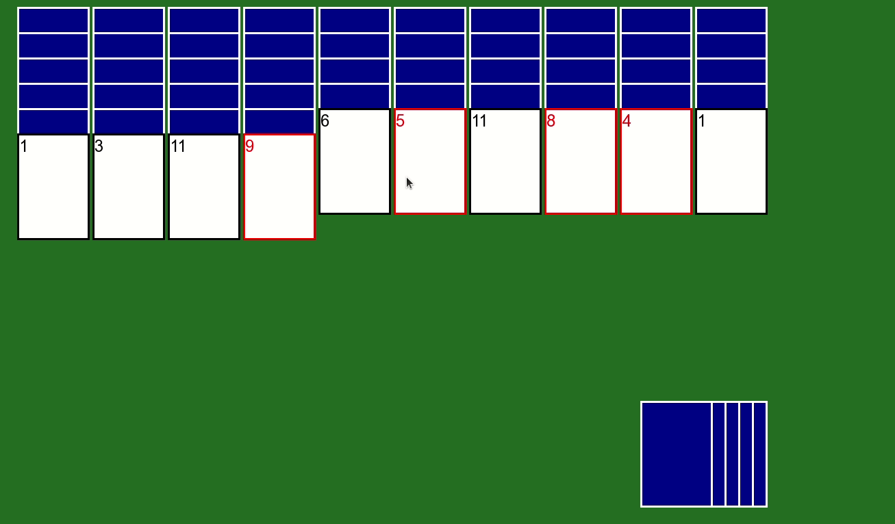

# Spider

The aim of spider (solitaire) is to remove all cards from the table. This demo is configured for one deck, two suit spider. That is, there is only one deck of 52 cards with suits red and black. To remove cards from the table, construct a complete pile of same coloured cards 0 to 12. Consecutive cards can be place on one another, however, only piles of the same color can be moved together.

## Install

SFML is required

`sudo apt-get install libsfml-dev`

Build & Run

```
make
./spider
```

## Example

